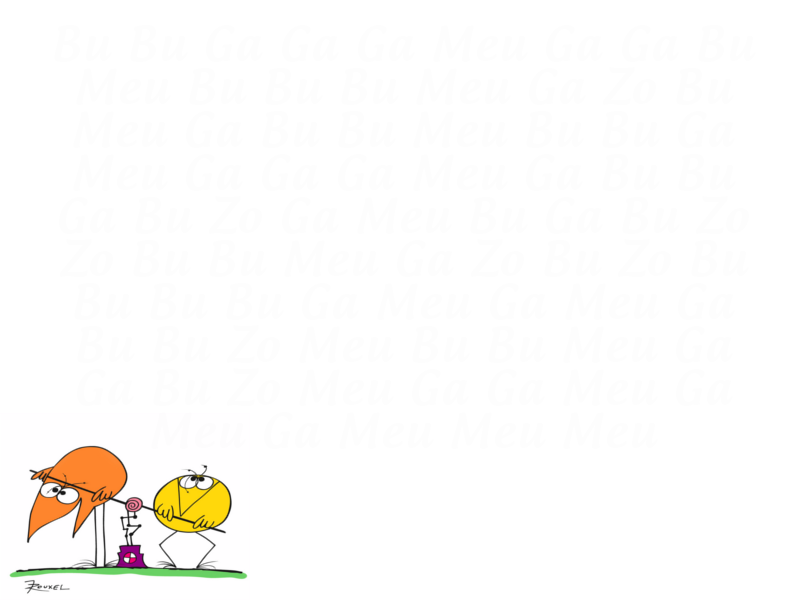
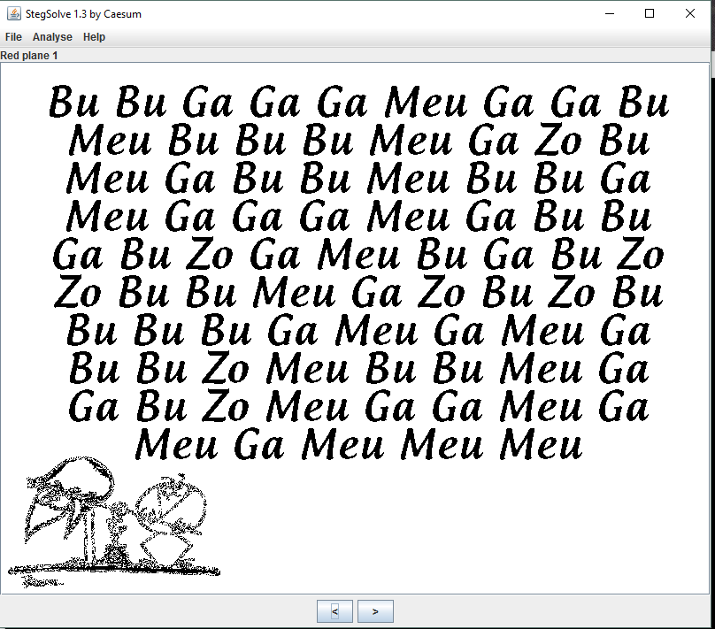

#Stegano - Pompe

There was given a file called ""

I decided to analyse it with StegSolve 1.3 by Caesum and found words written on the 2 last red bits :

Here is the witted message:

>BU BU GA GA GA MEU GA GA BU
>MEU BU BU BU MEU GA ZO BU
>MEU GA BU BU MEU BU BU GA
>MEU GA GA GA MEU GA GA BU
>GA BU ZO GA MEU BU GA BU ZO
>ZO BU BU MEU GA ZO BU ZO BU
>BU BU BU GA MEU GA MEU GA
>BU BU ZO MEU BU BU MEU GA
>GA BU ZO MEU GA GA MEU GA
>MEU GA MEU MEU MEU

After few search, I found that it was the "Shadok Language" (in base 4) :
http://www.dcode.fr/numeration-shadok

After decoding, I had an base 4 encoded string:
>11000300131113021301131103000301101203101221130212

Then I had to convert it to binary (from base 4 to base 2): 
http://www.dcode.fr/conversion-base-n

>101 0000 0011 0000 0111 0101 0111 0010 0111 0001 0111 0101 0011 0000 0011 0001 0100 0110 0011 0100 0110 1001 0111 0010 0110

The given number length wasnt a multiple of 4 (and will be problematic for ascii decoging), so i added a 0 at the begining :

>0101 0000 0011 0000 0111 0101 0111 0010 0111 0001 0111 0101 0011 0000 0011 0001 0100 0110 0011 0100 0110 1001 0111 0010 0110

Then I converted it to Ascii 
(there is good websites who do base convertion and ascii decoding).
For this, I used http://www.binaryhexconverter.com/binary-to-ascii-text-converter :

>P0urqu01F4ir
