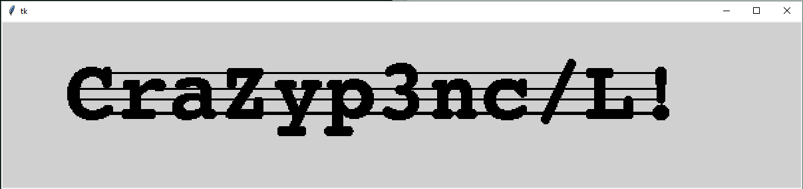

#[EN] Turtle
The title of the challenge was "Tortue" which mean "Turtle" in english.

It was a txt file : ""
The content of the file looked like :
>v>v<v>vvv<^^<vvv>>vv<...

Due to the title of the challenge, I remembered the python plugin "turtle" used for drawing.
So i decided to "draw" what the content of the file said. 

I used Python with the Tkinter plugin. I set up a Canvas and parsed each char, 
move 2px in the direction indicated by the current char and draw a 2x2 px square.

The script is avaible here : 

Screenshot of the flag diplayed by Canvas : 

#[FR] Tortue
Le titre de ce challenge était "Tortue".

Il était donné sous la forme d'un fichier txt : ""
Son contenu ressemblait à :
>v>v<v>vvv<^^<vvv>>vv<...

De par le titre du challenge, je me suis souvenu du plugin python "turtle" utilisé pour le dessin.
J'ai donc décidé de "dessiner" ce que le contenu du fichier disait. 

J'ai donc utilisé python et son plugin Tkinter. J'ai mit en place un Canvas puis parcouru chaque caractère, 
bougé de 2 px dans la position indiquée par le caractère courant afin de déssiner un carré de 2x2 px.

Le script est disponible ici: 

Capture d'écran du flag affiché par le Canvas : 

